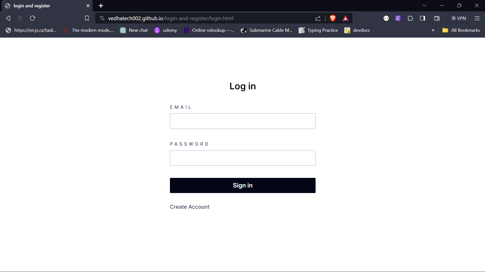
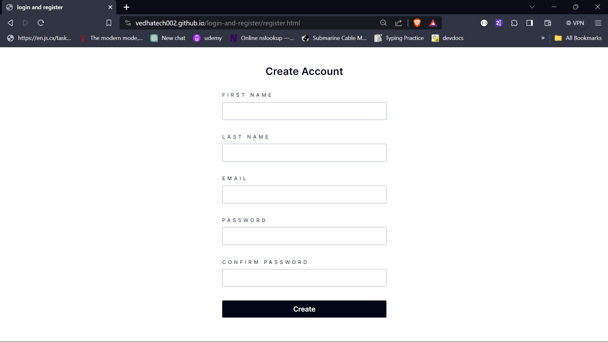
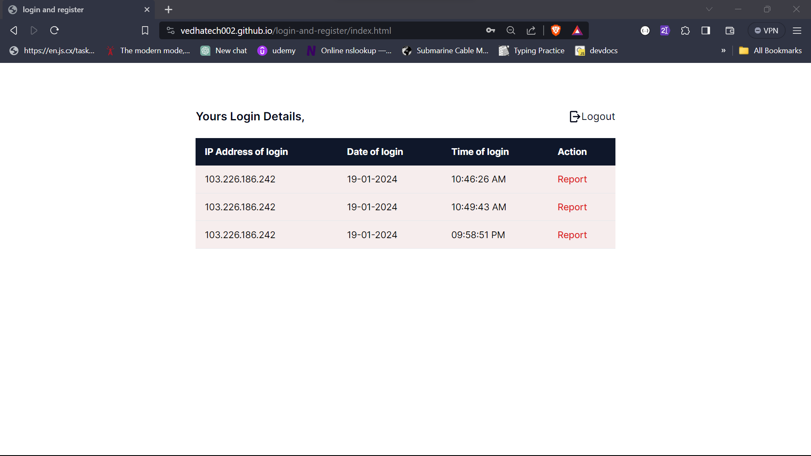

# Login History web App

> Task: The concept is, to create a signup and login, once you are logged in, it must show all the login history as well as the IP address.

## Project Description

I've implemented a basic login and registration system by utilizing fundamental JavaScript concepts such as FormData, localStorage, and sessionStorage. The system includes user authentication for login. Upon successful login, it displays historical login information, including the user's IP address, login date, and time. Additionally, I've incorporated a logout feature using sessionStorage.

## Javascript Challenge

This challenge is part of free internship (Fullstack Engineer) offered by [CyberDude Networks Pvt. Ltd.](https://cyberdudenetworks.com) You can find all the source code and live links below.

## Technologies used

 <ol>
 <li>HTML5</li>
 <li>TailwindCSS</li>
 <li>JavaScript</li>
 <li>Just validate(plugin)</li>
 </ol>

## Features

- register
- login
- logout
- end to end Authentication

## screenshots

##### Login Page



##### Register Page



##### Index page



## Live Link

You can watch the live site <a href="https://vedhatech002.github.io/login-and-register/">Here</a>

## Contribute

#### Fork this Repository

<button><a href="https://github.com/vedhatech002/login-and-register/fork">Fork</a></button>

#### clone forked Repository

```
git clone https://github.com/ <Your UserName > /login-and-register.git

```

#### Install the Dependencies

```
npm install
```

#### Run the Project

```
npm run dev
```

## License

[MIT](https://choosealicense.com/licenses/mit/)

### Connect with Me

- Connect with me on LinkedIn: [Vijayavedhasekaran K](www.linkedin.com/in/vijayavedhasekaran002)
- Follow me on Instagram: [@vedha_since_2002](https://www.instagram.com/vedha_since_2002/)
- Email: [vedhatech02@gmail.com](mailto:vedhatech02@gmail.com)

Feel free to reach out if you have any questions or would like to collaborate!
